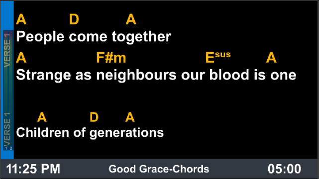

# Pro7ChordEditor

*Yep, it does what is says on the box!*  

This is a very simple/crude chord editor for Pro7 on Windows:

*Mac version is on my "TODO oneday list"*

You can add/edit chords to the lyrics of a song by typing them in [ChordPro](https://www.chordpro.org/) format. 
Just type them inline with the text surrounded by square brackets. You can insert a chord by typing either [, ], or any letter from A-G.
Once saved, the inline chords can then be displayed using the `Chords` option for textboxes on your stage display (the same as Multitracks).  

  
  
NB: You cannot edit the text of the song - you can only add/edit chords.  
You can change the `User Key` to have Pro7 *automatically transpose* the chords from the `Original Key`.  
  
⚠️This is an early beta version not for production use ⚠️  

However -  feel free to take the [latest release](https://github.com/greyshirtguy/Pro7ChordEditorWin/releases/latest) for a test-drive...   
...after making a 🦺BACKUP OF YOUR LIBRARIES🦺

**TODO:**
- Advertise for some public testers
- Test lots, gather feedback, discover and fix bugs until it's considered safe for general use.
- Currently it defaults to only looking at the *first* textbox on each slide - no support for 2nd/3rd etc textboxes...
- Probably make a new library for all presentations saved by this app (to keep them separated in a single folder)
- Perhaps add backups?

For safety it will NOT overwrite your existing files! Instead, when you save changes - it makes a copy of that file with a new name (-chord suffix added).
*If you choose to edit the new copy with -chord suffux - saved changes will overwrite that file*

Usual disclaimers apply - this is an *unsupported* 3rd party app - and it's very early in development - Use at your own risk!

Contributions welcome!
