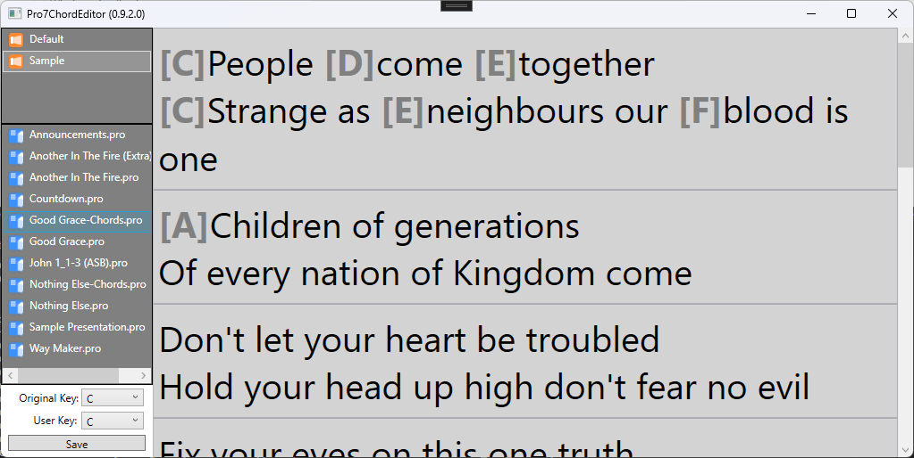

# Pro7ChordEditor

Yep, it does what is says on the box!
This is a very simple/crude chord editor for Pro7 on Windows.

(Mac version is on the TODO list)

You can add/edit chords to the lyrics of a song by typing them in [ChordPro](https://www.chordpro.org/) format - where chords are inline text inside square brackets.
Those chords can then be displayed using the `Chords` option for textboxes on your stage display.

This is not yet finished/ready to use (but I'm getting close!)

TODO:
- Test lots, discover bugs
- Fix bug when reading existing chords (don't try to edit a file that already has chords)
- Enable option to set original key and change key
- Probably make a new library for all presentations saved by this app (to keep them separated in a single folder)

For now, it will NOT edit existing files - instead, when you save changes - it makes a copy of that file with a new name (-chord suffix added).

Usual disclaimers apply - this is an *unsupported* 3rd party app - and it's very early in development - Use at your own risk!

Contributions welcome!
